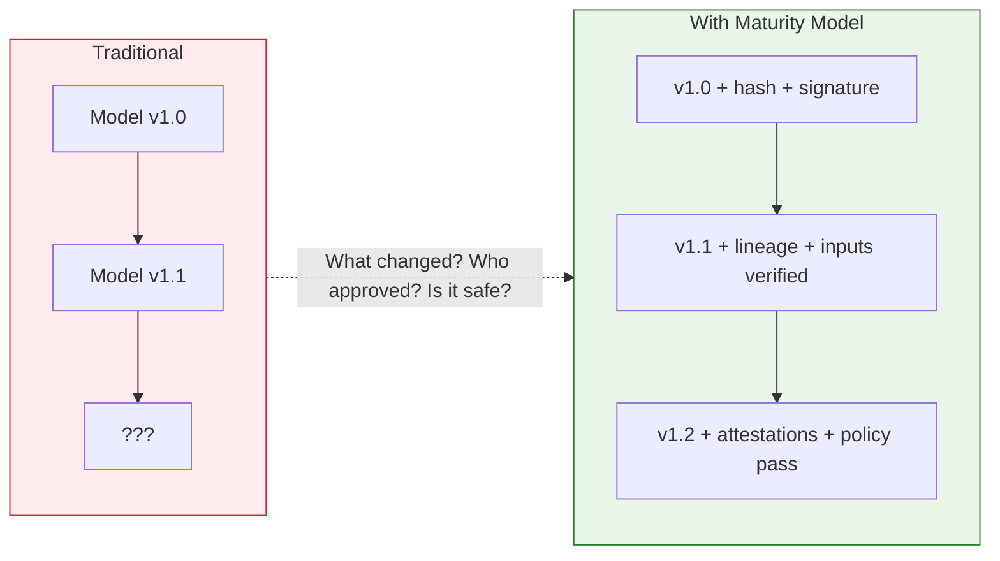
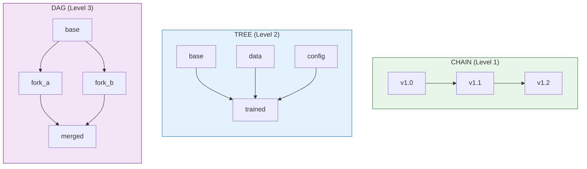
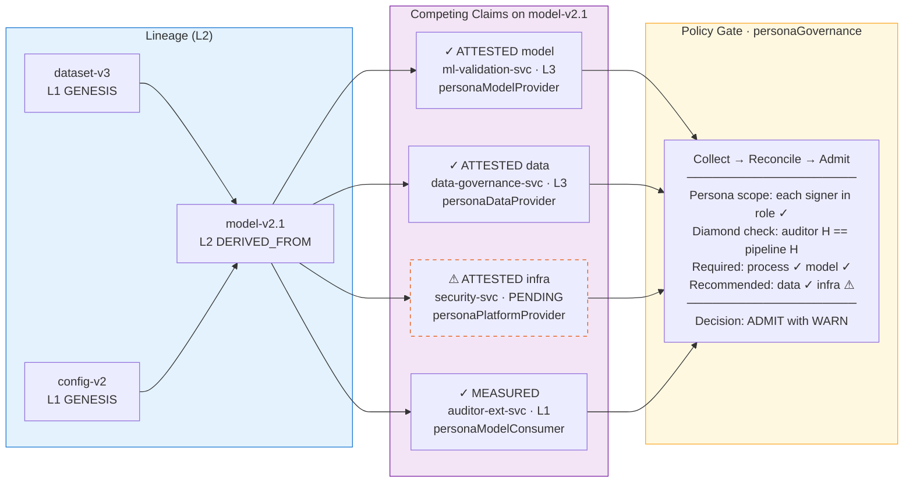
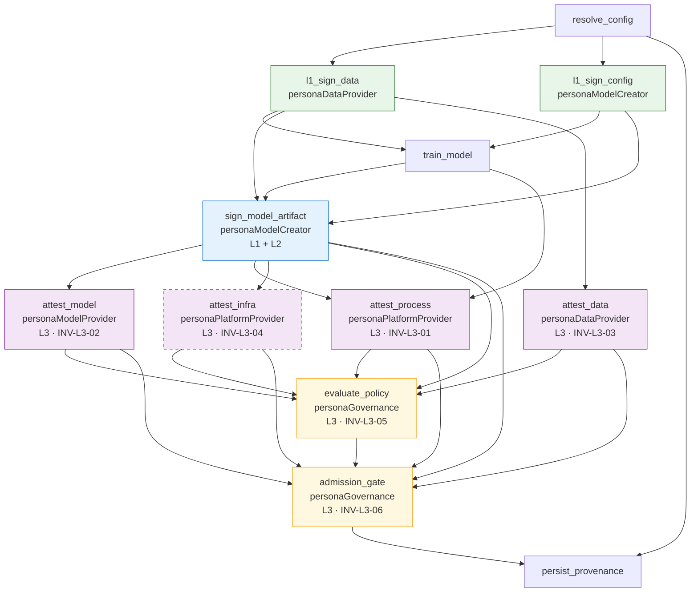

# Artifact Integrity Maturity Model
## Progressive Security for AI Artifact Provenance

**Version:** 1.3.0  
**Framework Alignment:** CoSAI-RM, MITRE ATLAS, OWASP LLM Top 10, SLSA, in-toto

---

## Abstract

AI artifacts (models, training data, configurations) require [cryptographic proof of integrity](https://in-toto.readthedocs.io/en/latest/command-line-tools/in-toto-verify.html), lineage, [runtime state](https://github.com/Trusera/ai-bom), and policy compliance. This standard defines a **progressive maturity model** enabling organizations to start with basic integrity and advance to full attestation-based provenance as operational requirements grow.

The model addresses three orthogonal concerns: **claims** (what can be proven), **topology** (how artifacts relate), and **verification** (how proofs are validated).

---

## The Fundamental Problem



**The vulnerability:** Artifacts flow through ML pipelines without cryptographic proof of what they are, where they came from, or whether they're safe to deploy.

**The solution:** Progressive claims that prove integrity (L1), lineage (L2), and policy compliance (L3).

---

## Maturity Levels

| Level | Name | Proves | Topology |
|-------|------|--------|----------|
| **1** | Basic Integrity | "This artifact exists, was created by X, and hasn't changed" | Chain |
| **2** | Chaining & Lineage | "This artifact was derived from verified inputs through a documented process" | Chain, Tree |
| **3** | Attestations & Policy | "This artifact meets policy requirements and is approved for deployment" | Chain, Tree, DAG |

---

## Persona Responsibilities by Level

Each maturity level distributes accountability across [CoSAI-RM personas](https://github.com/cosai-oasis/cosai-rm). The table below maps each persona to the invariants it is responsible for producing or verifying.

```mermaid
flowchart LR
    subgraph l1["Level 1 — Basic Integrity"]
        direction TB
        MC1["personaModelCreator<br/>Signs model artifacts"]
        DP1["personaDataProvider<br/>Signs data artifacts"]
        PP1["personaPlatformProvider<br/>Maintains trust store"]
    end

    subgraph l2["Level 2 — Lineage"]
        direction TB
        MC2["personaModelCreator<br/>Derivation + inputs"]
        DP2["personaDataProvider<br/>Verified input hashes"]
        PP2["personaPlatformProvider<br/>Chain infra + TSA"]
    end

    subgraph l3["Level 3 — Attestations & Policy"]
        direction TB
        MP3["personaModelProvider<br/>ATTESTED model"]
        DP3["personaDataProvider<br/>ATTESTED data"]
        PP3["personaPlatformProvider<br/>ATTESTED infra"]
        GOV["personaGovernance<br/>Policy + admission"]
    end

    l1 --> l2 --> l3

    style l1 fill:#e8f5e9,stroke:#2e7d32
    style l2 fill:#e3f2fd,stroke:#1976d2
    style l3 fill:#f3e5f5,stroke:#7b1fa2
```



| Persona | Level 1 Role | Level 2 Role | Level 3 Role |
|---------|-------------|-------------|-------------|
| **personaModelCreator** | Signs model manifests (INV-L1-02) | Documents derivation claims + input refs (INV-L2-01, L2-03) | — |
| **personaDataProvider** | Signs data artifact manifests (INV-L1-02) | Provides verified input hashes (INV-L2-02) | Produces ATTESTED(data): PII scan, license, source (INV-L3-03) |
| **personaPlatformProvider** | Maintains trust store (INV-L1-03) | Operates chain infrastructure + TSA (INV-L2-04, L2-05) | Produces ATTESTED(infra): security controls (INV-L3-04) |
| **personaModelProvider** | Distributes signed artifacts (INV-L1-01, L1-02) | Ensures lineage accompanies distributed artifacts (INV-L2-01) | Produces ATTESTED(model): metrics + fairness (INV-L3-02) |
| **personaModelServing** | — | — | Enforces admission gate before deployment (INV-L3-06) |
| **personaGovernance** | — | — | Defines policy rules, evaluates compliance (INV-L3-05), approves admission |
| **personaApplicationDeveloper** | Verifies hashes on artifact consumption | Validates lineage before integration | Checks attestation completeness before use |
| **personaAgenticProvider** | Verifies hashes for tool-invoked artifacts | Validates lineage for dynamically loaded artifacts | Enforces runtime attestation checks for agent-selected artifacts |
| **personaModelConsumer** | Verifies artifact authenticity via trust store | Inspects lineage claims for input provenance | Reviews policy evaluation results before relying on outputs |
| **personaEndUser** | — | — | Receives transparency disclosures from admission decisions |

**Identification heuristic:** If your team *signs* an artifact, you own its L1 claims. If your team *transforms* artifacts, you own L2 derivation. If your team *attests to quality or compliance*, you own L3 attestations for your domain. If your team *gates deployment*, you own L3 admission.

---

## Invariants by Level

### Level 1: Basic Integrity

| ID | Invariant | Assertion | Required | Responsible Persona(s) |
|----|-----------|-----------|----------|------------------------|
| INV-L1-01 | **Measured** | `H(artifact_content) == integrity.digest` | ✓ | Creator / Provider of artifact |
| INV-L1-02 | **Produced By** | `signature.signer == claimed_producer` | ✓ | personaModelCreator, personaDataProvider |
| INV-L1-03 | **Signer Verified** | `signer.subject ∈ trust_store` | ✓ | personaPlatformProvider |
| INV-L1-04 | **Timestamped** | `\|now() - signed_at\| < tolerance` | ○ | Signer + personaPlatformProvider (TSA) |

**Formal Claims:**
```
MEASURED <TARGET X> as (hash) SIGNED BY A
<TARGET X> was PRODUCED BY A
SIGNER A verified against trust_store
```

### Level 2: Chaining and Lineage

| ID | Invariant | Assertion | Required | Responsible Persona(s) |
|----|-----------|-----------|----------|------------------------|
| INV-L2-01 | **Derived From** | `lineage.inputs[].artifact_id EXISTS` | ✓ | personaModelCreator |
| INV-L2-02 | **Input Verified** | `∀ input: H(input) == original_digest` | ✓ | personaModelCreator (verifier), personaDataProvider (source) |
| INV-L2-03 | **Evidence Backed** | `derivation_claim.evidence EXISTS` | ○ | personaModelCreator |
| INV-L2-04 | **Chain Linked** | `H(prev.sig) == chain_signature.prev_hash` | ✓ | personaPlatformProvider |
| INV-L2-05 | **Timestamped (Strict)** | `\|now() - signed_at\| < 60s` | ✓ | personaPlatformProvider (TSA) |

**Formal Claims:**
```
<TARGET Y> was DERIVED FROM <TARGET X> SIGNED BY A
INPUT <TARGET X> was VERIFIED as Hash
INPUT <X.1> was DERIVED FROM <X> BY <PROCESS> SIGNED BY A
```

### Level 3: Attestations and Policy

| ID | Invariant | Assertion | Required | Responsible Persona(s) |
|----|-----------|-----------|----------|------------------------|
| INV-L3-01 | **Attested (Process)** | `attestations.process EXISTS + signed` | ✓ | personaPlatformProvider |
| INV-L3-02 | **Attested (Model)** | `IF type=model: attestations.model EXISTS` | Conditional | personaModelProvider |
| INV-L3-03 | **Attested (Data)** | `IF uses_training_data: attestations.data EXISTS` | Conditional | personaDataProvider |
| INV-L3-04 | **Attested (Infra)** | `attestations.infrastructure EXISTS` | ○ | personaPlatformProvider |
| INV-L3-05 | **Policy Evaluated** | `policy.evaluations[].result ∈ {PASS, WARN}` | ✓ | personaGovernance |
| INV-L3-06 | **Admission Gated** | `IF deploying: admission_status.admitted` | Conditional | personaGovernance, personaModelServing |

**Formal Claims:**
```
ATTESTED(process) by attester SIGNED
ATTESTED(model) with metrics SIGNED
POLICY_EVALUATED with result
ADMISSION_GATED for target environment
```

---

## Topology Selection

Organizations select lineage topology based on operational requirements:



| Topology | Max Inputs | Branching | Merging | Verification | Use Case |
|----------|------------|-----------|---------|--------------|----------|
| **Chain** | 1 | ✗ | ✗ | O(n) | Version history |
| **Tree** | ∞ | ✓ | ✗ | O(n) DFS | Training pipelines |
| **DAG** | ∞ | ✓ | ✓ | O(V+E) | Model merging, ensembles |

---

## Sensible Defaults

### Level 1 Defaults

```yaml
integrity:
  algorithm: SHA256
  alternatives: [SHA384, SHA512, SHA3-256]

signature:
  algorithm: RS256
  alternatives: [ES256, ES384, EdDSA]
  key_rotation_days: 90
  min_key_size_rsa: 2048
  min_key_size_ec: 256

timestamp:
  required: false
  tolerance_seconds: 300
  source: local

trust_store:
  type: static
  refresh_hours: 24
```

### Level 2 Defaults (Overrides)

```yaml
timestamp:
  required: true           # Now mandatory
  tolerance_seconds: 60    # Stricter
  source: tsa              # Time Stamping Authority

lineage:
  max_chain_depth: 100
  input_verification: required
  process_parameters_hash: required
  log_retention_days: 365
```

### Level 3 Defaults (Overrides)

```yaml
signature:
  algorithm: ES384         # Stronger curve

attestations:
  required_categories: [process]
  recommended_categories: [model, data, process, infrastructure]
  predicate_types:
    default: "https://in-toto.io/attestation/v1"
    provenance: "https://slsa.dev/provenance/v1"
  attester_trust_level_for_production: high

policy:
  engine: opa
  format: rego
  minimum_rules:
    - artifact_integrity
    - lineage_verified
    - attestations_present
  admission_controller: gatekeeper

compliance:
  evidence_retention_days: 2555  # 7 years
  check_frequency: daily
```

---

## Risks & Controls

### Risk: Artifact Tampering (ATLAS: AML.T0048)
**Threat:** Artifact content modified after signing.  
**Control:** INV-L1-01 — Hash verification detects any modification.

### Risk: Lineage Manipulation
**Threat:** False derivation claims or input substitution.  
**Control:** INV-L2-02 — All input hashes verified before derivation.

### Risk: Diamond Inconsistency (DAG only)
**Threat:** Same artifact has different hashes via different paths.  
**Control:** Diamond consistency check during DAG verification.

### Risk: Attestation Forgery (ATLAS: AML.T0043)
**Threat:** False attestations about model performance or data provenance.  
**Control:** INV-L3-01/02/03 — Attestation signatures verified against trusted attesters.

### Risk: Policy Bypass
**Threat:** Deployment without required policy evaluation.  
**Control:** INV-L3-05/06 — Policy evaluation and admission gate required.

### Risk: Persona Boundary Violation
**Threat:** A persona signs claims outside its designated scope (e.g., personaModelCreator producing ATTESTED(infra) claims).  
**Control:** Trust policy restricts each signer's `subject` to claims matching its persona role. Verification step INV-L1-03 rejects out-of-scope signatures.

---

## Validation Sequence

### Level 1

```
1. VERIFY signature.algorithm ∈ allowed_algorithms
2. VERIFY signature over canonical manifest              [INV-L1-02]
3. VERIFY signer.subject ∈ trust_store                   [INV-L1-03]
3a. VERIFY signer.persona_role permits claim_type        [Persona scope check]
4. VERIFY H(artifact_content) == integrity.digest        [INV-L1-01] ← critical
5. IF timestamp: VERIFY |now() - signed_at| < tolerance  [INV-L1-04]
6. RETURN {measured: ✓, produced_by: ✓, signer_verified: ✓}
```

### Level 2 (extends Level 1)

```
7.  VERIFY chain_position > 0 OR chain_integrity == "GENESIS"
8.  FOR EACH input: VERIFY H(input) == original_digest   [INV-L2-02] ← critical
9.  IF previous: VERIFY H(prev.sig) == prev_sig_hash     [INV-L2-04]
10. IF topology == TREE: VERIFY no_diamonds(graph)
11. IF EVIDENCE_BACKED: VERIFY evidence exists           [INV-L2-03]
12. RETURN L1 + {derived_from: ✓, inputs_verified: ✓, chain_valid: ✓}
```

### Level 3 (extends Level 2)

```
13. IF topology == DAG: VERIFY no_cycles(graph)
14. IF topology == DAG: VERIFY diamond_consistency(graph)
15. VERIFY attestations.process EXISTS + signature       [INV-L3-01]
16. IF type=model: VERIFY attestations.model EXISTS      [INV-L3-02]
17. IF uses_training_data: VERIFY attestations.data      [INV-L3-03]
18. FOR EACH attestation: VERIFY attester.persona_role matches attestation category
19. FOR EACH eval: VERIFY result ∈ {PASS, WARN}          [INV-L3-05]
20. IF deploying: VERIFY admitted == true                [INV-L3-06]
21. RETURN L2 + {attested: ✓, policy_passed: ✓, admitted: ✓}
```

---

## Multi-Party Claim Navigation

When claims about the same artifact come from different signers, verification uses a **pointer-by-subject index** — grouping all claims by `artifact_id`, then verifying each signature independently before checking completeness and consistency. See the [competing claims example](#example-competing-claims-on-a-single-artifact) for a concrete illustration.

### Verification Algorithm

```python
def verify_multi_party(artifact_id, trust_policy):
    # 1. Collect all claims about this artifact
    claims = collect_claims_by_subject(artifact_id)
    
    # 2. Verify each claim's signature independently
    for claim in claims:
        verify_signature(claim, claim.signer)
        verify_signer_trusted(claim.signer, trust_policy)
        # 2a. Verify signer's persona role permits this claim type
        verify_persona_scope(claim.signer, claim.claim_type, trust_policy)
    
    # 3. Recurse into referenced artifacts (DAG traversal)
    for input_ref in get_input_references(claims):
        verify_multi_party(input_ref.artifact_id, trust_policy)
    
    # 4. Check claim completeness per level
    assert has_required_claims(claims, artifact.maturity_level)
    
    # 5. Evaluate cross-claim consistency
    assert claims_consistent(claims)
```

### Conflict Resolution Strategies

| Strategy | Description | Use When |
|----------|-------------|----------|
| **FAIL** | Any conflict fails verification | High-security environments |
| **QUORUM** | Majority of trusted parties wins | Distributed trust |
| **PRIORITY** | Higher trust level wins | Hierarchical trust |
| **TEMPORAL** | Most recent claim wins | Evolving state |

---

## Example: Competing Claims on a Single Artifact

In production, different teams sign claims about the same artifact at different maturity levels, on different schedules, and with varying degrees of completeness. The policy gate must reconcile these **competing claims** before admission.



Four independent signers produce claims about `model-v2.1` at different levels:

| Signer | Persona | Claim | Level | Status |
|--------|---------|-------|-------|--------|
| `ml-platform-svc` | personaModelCreator | DERIVED_FROM | L2 | ✓ Full lineage from GENESIS |
| `ml-validation-svc` | personaModelProvider | ATTESTED(model) | L3 | ✓ Accuracy + fairness |
| `data-governance-svc` | personaDataProvider | ATTESTED(data) | L3 | ✓ PII scan + license |
| `security-svc` | personaPlatformProvider | ATTESTED(infra) | L3 | ⚠ Pending |
| `auditor-ext-svc` | personaModelConsumer | MEASURED | L1 | ✓ Independent hash only |

The policy gate (operated by **personaGovernance**) applies three reconciliation patterns:

**Persona scope check** — Each signer's claim type must match its persona role. `ml-validation-svc` (personaModelProvider) may produce ATTESTED(model) but not ATTESTED(infra). Out-of-scope claims are rejected before reconciliation.

**Diamond consistency** — The external auditor (personaModelConsumer) independently hashes the model without access to the pipeline's manifest. If `H(auditor) ≠ H(pipeline)`, the artifact was modified between measurements — hard FAIL regardless of conflict strategy.

**PRIORITY on completeness** — Required attestations (process, model) must PASS. Recommended attestations (infra) that are pending produce a WARN. The model is admitted at 83% completeness with the gap recorded in the provenance bundle.

---

## Framework Mappings

| Standard | Reference | Coverage |
|----------|-----------|----------|
| **MITRE ATLAS** | AML.T0043, AML.T0048 | Supply chain, data manipulation |
| **OWASP LLM Top 10** | LLM03, LLM06, LLM08 | Training data poisoning, excessive agency |
| **SLSA** | Levels 1-4 | Build provenance |
| **in-toto** | Attestation framework | Attestation predicates |
| **STRIDE** | All categories | Full coverage |
| **NIST AI RMF** | GOVERN, MAP, MEASURE, MANAGE | Risk governance |
| **CoSAI-RM** | Personas, Controls | Persona-scoped accountability |

---

## Compliance Mappings

| Framework | Controls | Evidence Sources |
|-----------|----------|------------------|
| **SOC2** | CC6.1, CC7.1, CC7.2 | attestations.process, attestations.infrastructure |
| **NIST AI RMF** | GOVERN-1.1, MAP-3.1, MEASURE-2.1 | attestations.model, attestations.data |
| **ISO 27001** | A.12.1, A.14.2 | attestations.infrastructure, policy.evaluations |
| **PCI DSS** | 6.3, 6.5, 10.1 | audit, lineage, attestations.process |

---

## Implementation Checklist

### Level 1: Basic Integrity

```yaml
checklist:
  - [ ] Generate unique artifact IDs
  - [ ] Compute SHA256 hash of content
  - [ ] Sign artifact manifest with RS256/ES256
  - [ ] Store signer certificate in trust store with persona role binding
  - [ ] Implement hash verification on access
  - [ ] Include L2 anchor points in schema
```

### Level 2: Chaining and Lineage

```yaml
checklist:
  - [ ] Add chain tracking (chain_id, chain_position)
  - [ ] Verify all input artifact hashes before derivation
  - [ ] Include chain_signature linking to previous
  - [ ] Add derivation_claim with evidence
  - [ ] Implement input verification in pipeline tasks (see Airflow example)
  - [ ] Configure TSA-backed timestamps for production chains
  - [ ] Include L3 anchor points in schema
```

### Level 3: Attestations and Policy

```yaml
checklist:
  - [ ] Add attestations.process (always required)
  - [ ] Add attestations.model (when type=model)
  - [ ] Add attestations.data (when using training data)
  - [ ] Configure OPA/Rego policy evaluation
  - [ ] Add persona scope rules to policy (signer role ↔ claim type)
  - [ ] Implement Gatekeeper admission control
  - [ ] Map to compliance frameworks
  - [ ] Enable automated compliance checks
  - [ ] IF DAG: Implement cycle detection + diamond consistency
```

---

## Security Guarantees

When all invariants for a level are satisfied:

| Level | Guarantees |
|-------|------------|
| **L1** | Integrity (content matches hash), Authenticity (signer verified), Non-tampering (modifications detected) |
| **L2** | + Lineage (inputs verified), Reproducibility (process documented), Chain integrity (no breaks) |
| **L3** | + Attestation validity (signed by trusted parties in-role), Policy compliance (rules passed), Deployment safety (admitted), Persona accountability (each claim traceable to a scoped role) |

---

## Appendix A: Claim Progression Summary

```
LEVEL 1 (Basic Integrity)
├── MEASURED: H(content) SIGNED BY A
├── PRODUCED_BY: <X> was PRODUCED BY A  
├── SIGNER_VERIFIED: A ∈ trust_store ∧ A.persona permits claim
└── TIMESTAMPED: t ∈ range (OPTIONAL)

LEVEL 2 (Chaining + Lineage) — Inherits Level 1
├── DERIVED_FROM: <Y> DERIVED FROM <X> SIGNED BY A
├── INPUT_VERIFIED: INPUT <X> VERIFIED as Hash
├── EVIDENCE_BACKED: <X.1> DERIVED FROM <X> BY <PROCESS> SIGNED BY A
└── CHAIN_LINKED: H(prev_sig) in chain_signature

LEVEL 3 (Attestations + Policy) — Inherits Level 2
├── ATTESTED (process): SLSA provenance SIGNED BY attester [personaPlatformProvider]
├── ATTESTED (model): Metrics + fairness SIGNED BY attester [personaModelProvider] (conditional)
├── ATTESTED (data): Source + PII scan SIGNED BY attester [personaDataProvider] (conditional)
├── ATTESTED (infra): Security controls SIGNED BY attester [personaPlatformProvider] (recommended)
├── POLICY_EVALUATED: OPA result with rule details [personaGovernance]
└── ADMISSION_GATED: Explicit admission decision [personaGovernance, personaModelServing] (conditional)
```

---

## Appendix B: Persona ↔ Invariant Quick Reference

For rapid lookup during implementation or audit, this table inverts the responsibility matrix — given a persona, which invariants must it satisfy?

| Persona ID | Must Produce | Must Verify |
|------------|-------------|-------------|
| `personaModelCreator` | INV-L1-01, L1-02, L2-01, L2-03 | INV-L2-02 (input hashes) |
| `personaDataProvider` | INV-L1-01, L1-02, L3-03 | — |
| `personaPlatformProvider` | INV-L1-03 (trust store), L2-04, L2-05, L3-01, L3-04 | — |
| `personaModelProvider` | INV-L3-02 | INV-L2-01 (lineage accompanies distribution) |
| `personaModelServing` | INV-L3-06 (admission enforcement) | All prior levels before serving |
| `personaGovernance` | INV-L3-05, L3-06 (policy + admission) | Cross-claim consistency |
| `personaApplicationDeveloper` | — | INV-L1-01, L2-01, L3-05 (before integration) |
| `personaAgenticProvider` | — | INV-L1-01, L2-01, L3-05 (runtime, per invocation) |
| `personaModelConsumer` | — | INV-L1-01, L1-03 (authenticity before use) |
| `personaEndUser` | — | — (receives transparency disclosures) |

---

## Appendix C: Reference Airflow DAG — AIMM Pipeline with in-toto Signing

This appendix provides a complete, pure-Python Apache Airflow DAG that implements AIMM Level 1→3 signing using [in-toto](https://in-toto.io/) statement envelopes. The DAG is configurable at runtime — set `aimm_level` to `1`, `2`, or `3` to control which invariants are enforced. Level 3 tasks self-skip via `AirflowSkipException` when running at lower levels, keeping the DAG graph stable for monitoring.

### DAG Topology


### Configuration

Set via Airflow Variables or DAG-run params:

| Parameter | Default | Description |
|-----------|---------|-------------|
| `aimm_level` | `3` | Maturity level: 1 (hash+sign), 2 (+lineage), 3 (+attestations+policy) |
| `signing_key_path` | `/etc/aimm/keys/signer.pem` | PEM private key (or KMS URI in production) |
| `trust_store_path` | `/etc/aimm/trust_store/` | Directory of trusted signer certificates |
| `opa_endpoint` | `http://opa:8181` | OPA REST endpoint for policy evaluation |
| `tsa_endpoint` | `http://tsa:318` | RFC 3161 Time Stamping Authority |
| `artifact_store` | `s3://aimm-artifacts` | Artifact repository URI |
| `hash_algorithm` | `sha256` | Digest algorithm (SHA256/384/512/SHA3-256) |

### Task ↔ Invariant Mapping

| Task | Persona | Invariants | Level |
|------|---------|------------|-------|
| `l1_sign_data` | personaDataProvider | INV-L1-01, L1-02 | 1 |
| `l1_sign_config` | personaModelCreator | INV-L1-01, L1-02 | 1 |
| `sign_model_artifact` | personaModelCreator | INV-L1-01, L1-02, L2-01..05 | 1–2 |
| `attest_model` | personaModelProvider | INV-L3-02 | 3 |
| `attest_data` | personaDataProvider | INV-L3-03 | 3 |
| `attest_process` | personaPlatformProvider | INV-L3-01 | 3 |
| `attest_infra` | personaPlatformProvider | INV-L3-04 | 3 |
| `evaluate_policy` | personaGovernance | INV-L3-05 | 3 |
| `admission_gate` | personaGovernance | INV-L3-06 | 3 |

### Design Notes

**Crypto boundary isolation.** `sign_payload()` and `request_timestamp()` fall through to HMAC/local stubs when `securesystemslib` or `rfc3161ng` are not installed. The DAG is syntactically valid and testable in CI without real key material. Swap in KMS URIs for production:
```python
# Dev/CI (automatic fallback)
sig = sign_payload(payload, "/path/to/dev.pem", "ES384")

# Production — use KMS signer in securesystemslib
# signer = CryptoSigner.from_priv_key_uri("awskms:///alias/aimm-signer")
```

**Persona scope enforcement.** `verify_persona_scope()` runs inside the manifest builders, not as a separate policy check. A mis-wired task that attempts to sign with the wrong persona hard-fails with `AirflowFailException` before any signature is produced, enforcing the INV-L1-03 trust policy.

**L3 self-skip.** All attestation tasks check `cfg.level < MaturityLevel.L3_ATTESTATIONS` and raise `AirflowSkipException`. This avoids `BranchPythonOperator` complexity; the DAG graph is identical at all levels, only task states change.

**Built-in + remote policy.** `evaluate_policy` runs four local rules (artifact integrity, lineage verification, attestation completeness, persona scope), then also tries the remote OPA endpoint. Built-in rules always execute; OPA supplements them.

### Source
```python
"""
AIMM Pipeline DAG — Artifact Integrity Maturity Model (Level 1→3)
=================================================================

A configurable Apache Airflow DAG that orchestrates ML artifact production
with progressive in-toto signing at each AIMM maturity level.

Configuration
-------------
Set via Airflow Variables or DAG params:

    aimm_level            : 1 | 2 | 3          (default: 3)
    signing_key_path      : path to PEM key     (default: /etc/aimm/keys/signer.pem)
    trust_store_path      : path to trust store  (default: /etc/aimm/trust_store/)
    opa_endpoint          : OPA REST endpoint    (default: http://opa:8181)
    tsa_endpoint          : RFC 3161 TSA URL     (default: http://tsa:318)
    artifact_store        : URI for artifact repo
    attestation_predicates: dict of predicate URIs per category

Framework alignment: CoSAI-RM personas, SLSA provenance, in-toto attestations.
"""

from __future__ import annotations

import hashlib
import json
import logging
import os
import time
import uuid
from dataclasses import asdict, dataclass, field
from datetime import datetime, timedelta, timezone
from enum import IntEnum
from pathlib import Path
from typing import Any

from airflow import DAG
from airflow.decorators import task
from airflow.exceptions import AirflowFailException, AirflowSkipException
from airflow.models import Variable

# ---------------------------------------------------------------------------
# Domain types
# ---------------------------------------------------------------------------

log = logging.getLogger("aimm")


class MaturityLevel(IntEnum):
    L1_BASIC_INTEGRITY = 1
    L2_LINEAGE = 2
    L3_ATTESTATIONS = 3


class ClaimType:
    MEASURED = "MEASURED"
    PRODUCED_BY = "PRODUCED_BY"
    SIGNER_VERIFIED = "SIGNER_VERIFIED"
    TIMESTAMPED = "TIMESTAMPED"
    DERIVED_FROM = "DERIVED_FROM"
    INPUT_VERIFIED = "INPUT_VERIFIED"
    EVIDENCE_BACKED = "EVIDENCE_BACKED"
    CHAIN_LINKED = "CHAIN_LINKED"
    ATTESTED_PROCESS = "ATTESTED_PROCESS"
    ATTESTED_MODEL = "ATTESTED_MODEL"
    ATTESTED_DATA = "ATTESTED_DATA"
    ATTESTED_INFRA = "ATTESTED_INFRA"
    POLICY_EVALUATED = "POLICY_EVALUATED"
    ADMISSION_GATED = "ADMISSION_GATED"


# Persona → permitted claim types (INV-L1-03 scope check)
PERSONA_CLAIM_SCOPE: dict[str, set[str]] = {
    "personaModelCreator": {
        ClaimType.MEASURED,
        ClaimType.PRODUCED_BY,
        ClaimType.DERIVED_FROM,
        ClaimType.INPUT_VERIFIED,
        ClaimType.EVIDENCE_BACKED,
    },
    "personaDataProvider": {
        ClaimType.MEASURED,
        ClaimType.PRODUCED_BY,
        ClaimType.ATTESTED_DATA,
    },
    "personaPlatformProvider": {
        ClaimType.SIGNER_VERIFIED,
        ClaimType.TIMESTAMPED,
        ClaimType.CHAIN_LINKED,
        ClaimType.ATTESTED_PROCESS,
        ClaimType.ATTESTED_INFRA,
    },
    "personaModelProvider": {
        ClaimType.ATTESTED_MODEL,
    },
    "personaGovernance": {
        ClaimType.POLICY_EVALUATED,
        ClaimType.ADMISSION_GATED,
    },
    "personaModelServing": {
        ClaimType.ADMISSION_GATED,
    },
}


@dataclass
class AIMMConfig:
    """Runtime configuration — populated from Airflow Variables / params."""

    level: MaturityLevel = MaturityLevel.L3_ATTESTATIONS
    signing_key_path: str = "/etc/aimm/keys/signer.pem"
    trust_store_path: str = "/etc/aimm/trust_store/"
    opa_endpoint: str = "http://opa:8181"
    tsa_endpoint: str = "http://tsa:318"
    artifact_store: str = "s3://aimm-artifacts"
    hash_algorithm: str = "sha256"
    signature_algorithm: str = "ES384"
    timestamp_tolerance_seconds: int = 60
    chain_id: str = ""
    attestation_predicates: dict[str, str] = field(default_factory=lambda: {
        "default": "https://in-toto.io/attestation/v1",
        "provenance": "https://slsa.dev/provenance/v1",
    })

    @classmethod
    def from_airflow(cls, params: dict[str, Any] | None = None) -> "AIMMConfig":
        """Merge Airflow Variables with DAG-run params (params win)."""
        params = params or {}
        return cls(
            level=MaturityLevel(
                int(params.get("aimm_level", Variable.get("aimm_level", 3)))
            ),
            signing_key_path=params.get(
                "signing_key_path",
                Variable.get("signing_key_path", cls.signing_key_path),
            ),
            trust_store_path=params.get(
                "trust_store_path",
                Variable.get("trust_store_path", cls.trust_store_path),
            ),
            opa_endpoint=params.get(
                "opa_endpoint",
                Variable.get("opa_endpoint", cls.opa_endpoint),
            ),
            tsa_endpoint=params.get(
                "tsa_endpoint",
                Variable.get("tsa_endpoint", cls.tsa_endpoint),
            ),
            artifact_store=params.get(
                "artifact_store",
                Variable.get("artifact_store", cls.artifact_store),
            ),
            hash_algorithm=params.get(
                "hash_algorithm",
                Variable.get("aimm_hash_algorithm", cls.hash_algorithm),
            ),
            chain_id=params.get("chain_id", Variable.get("aimm_chain_id", "")),
        )


# ---------------------------------------------------------------------------
# Crypto helpers (in-toto compatible)
# ---------------------------------------------------------------------------


@dataclass
class IntotoStatement:
    """Minimal in-toto v1 statement envelope."""

    _type: str = "https://in-toto.io/Statement/v1"
    subject: list[dict] = field(default_factory=list)
    predicateType: str = ""
    predicate: dict = field(default_factory=dict)

    def canonical(self) -> bytes:
        """Canonical JSON for signing (sorted keys, no whitespace)."""
        return json.dumps(asdict(self), sort_keys=True, separators=(",", ":")).encode()


def compute_digest(content: bytes, algorithm: str = "sha256") -> str:
    """INV-L1-01: Compute artifact digest."""
    h = hashlib.new(algorithm)
    h.update(content)
    return f"{algorithm}:{h.hexdigest()}"


def compute_file_digest(path: str | Path, algorithm: str = "sha256") -> str:
    """INV-L1-01: Compute digest over a file, streaming for large artifacts."""
    h = hashlib.new(algorithm)
    with open(path, "rb") as f:
        for chunk in iter(lambda: f.read(1 << 20), b""):
            h.update(chunk)
    return f"{algorithm}:{h.hexdigest()}"


def sign_payload(payload: bytes, key_path: str, algorithm: str = "ES384") -> dict:
    """
    Sign a payload using the configured key.

    Returns an in-toto DSSE envelope dict.  In production, swap this for
    securesystemslib or sigstore-python; this stub isolates the crypto
    boundary so the DAG logic remains testable without real keys.
    """
    try:
        from securesystemslib.signer import CryptoSigner

        signer = CryptoSigner.from_priv_key_uri(
            f"file://{key_path}?encrypted=false",
            # In production, use a KMS URI instead:
            # f"awskms:///{key_id}" or f"gcpkms:///{key_resource}"
        )
        sig = signer.sign(payload)
        return {
            "keyid": sig.keyid,
            "sig": sig.signature.hex(),
            "algorithm": algorithm,
        }
    except ImportError:
        log.warning("securesystemslib not installed; using HMAC stub signer")
        import hmac

        stub_key = Path(key_path).read_bytes() if Path(key_path).exists() else b"dev"
        sig = hmac.new(stub_key, payload, "sha384").hexdigest()
        return {"keyid": "stub", "sig": sig, "algorithm": "HMAC-SHA384-STUB"}


def request_timestamp(digest: str, tsa_endpoint: str) -> dict:
    """
    INV-L1-04 / INV-L2-05: Request a trusted timestamp.

    Production: POST to an RFC 3161 TSA.  Stub returns local time.
    """
    try:
        import requests
        from rfc3161ng import RemoteTimestamper

        stamper = RemoteTimestamper(tsa_endpoint)
        token = stamper.timestamp(digest.encode())
        return {
            "tsa": tsa_endpoint,
            "token_b64": token.hex(),
            "signed_at": datetime.now(timezone.utc).isoformat(),
        }
    except ImportError:
        log.warning("rfc3161ng not installed; using local timestamp stub")
        return {
            "tsa": "local-stub",
            "token_b64": "",
            "signed_at": datetime.now(timezone.utc).isoformat(),
        }


def verify_persona_scope(persona: str, claim_type: str) -> None:
    """
    INV-L1-03 scope check: reject claims outside persona role.

    Raises AirflowFailException on violation so the DAG hard-fails
    rather than silently producing an out-of-scope claim.
    """
    allowed = PERSONA_CLAIM_SCOPE.get(persona, set())
    if claim_type not in allowed:
        raise AirflowFailException(
            f"Persona scope violation: {persona} cannot produce {claim_type}. "
            f"Allowed: {allowed}"
        )


# ---------------------------------------------------------------------------
# Manifest builders
# ---------------------------------------------------------------------------


def build_l1_manifest(
    artifact_id: str,
    digest: str,
    signer_persona: str,
    signature: dict,
    timestamp: dict | None = None,
) -> dict:
    """Level 1 manifest — Basic Integrity (INV-L1-01..04)."""
    verify_persona_scope(signer_persona, ClaimType.MEASURED)
    verify_persona_scope(signer_persona, ClaimType.PRODUCED_BY)

    manifest = {
        "schema_version": "1.2.0",
        "maturity_level": 1,
        "artifact_id": artifact_id,
        "integrity": {
            "digest": digest,
            "claim": ClaimType.MEASURED,
        },
        "producer": {
            "persona": signer_persona,
            "claim": ClaimType.PRODUCED_BY,
        },
        "signature": signature,
        # Anchor points for L2 — present but empty at L1
        "lineage": None,
        "chain_signature": None,
        # Anchor points for L3 — present but empty at L1
        "attestations": None,
        "policy": None,
    }
    if timestamp:
        manifest["timestamp"] = {**timestamp, "claim": ClaimType.TIMESTAMPED}
    return manifest


def extend_l2_manifest(
    manifest: dict,
    chain_id: str,
    chain_position: int,
    input_digests: list[dict],
    derivation_evidence: dict | None,
    prev_sig_hash: str | None,
    signer_persona: str,
    signature: dict,
    timestamp: dict,
) -> dict:
    """Level 2 extension — Lineage (INV-L2-01..05)."""
    verify_persona_scope(signer_persona, ClaimType.DERIVED_FROM)

    manifest["maturity_level"] = 2
    manifest["lineage"] = {
        "claim": ClaimType.DERIVED_FROM,
        "inputs": input_digests,
        "derivation_claim": {
            "claim": ClaimType.EVIDENCE_BACKED,
            "evidence": derivation_evidence,
        } if derivation_evidence else None,
    }
    manifest["chain_signature"] = {
        "chain_id": chain_id,
        "chain_position": chain_position,
        "prev_sig_hash": prev_sig_hash,
        "claim": ClaimType.CHAIN_LINKED,
        "signature": signature,
    }
    manifest["timestamp"] = {**timestamp, "claim": ClaimType.TIMESTAMPED}
    return manifest


def extend_l3_manifest(
    manifest: dict,
    attestations: dict[str, dict],
    policy_evaluations: list[dict],
    admission: dict | None,
) -> dict:
    """Level 3 extension — Attestations & Policy (INV-L3-01..06)."""
    manifest["maturity_level"] = 3
    manifest["attestations"] = attestations
    manifest["policy"] = {
        "evaluations": policy_evaluations,
        "claim": ClaimType.POLICY_EVALUATED,
    }
    if admission:
        manifest["admission"] = {
            **admission,
            "claim": ClaimType.ADMISSION_GATED,
        }
    return manifest


# ---------------------------------------------------------------------------
# Airflow tasks
# ---------------------------------------------------------------------------

default_args = {
    "owner": "aimm",
    "retries": 1,
    "retry_delay": timedelta(minutes=2),
}


with DAG(
    dag_id="aimm_ml_pipeline",
    description="ML pipeline with AIMM Level 1-3 in-toto signing",
    default_args=default_args,
    schedule=None,
    start_date=datetime(2025, 1, 1),
    catchup=False,
    tags=["aimm", "security", "ml", "cosai"],
    params={
        "aimm_level": 3,
        "signing_key_path": "/etc/aimm/keys/signer.pem",
        "model_artifact_path": "/tmp/aimm/model.pt",
        "data_artifact_path": "/tmp/aimm/training_data.parquet",
        "chain_id": "",
    },
    render_template_as_native_obj=True,
) as dag:

    # ------------------------------------------------------------------
    # Task 0: Resolve configuration
    # ------------------------------------------------------------------
    @task(task_id="resolve_config")
    def resolve_config(**context) -> dict:
        """Build AIMMConfig from Variables + DAG-run params."""
        cfg = AIMMConfig.from_airflow(context["params"])
        if not cfg.chain_id:
            cfg.chain_id = f"chain-{uuid.uuid4().hex[:12]}"
        log.info("AIMM config resolved: level=%s chain=%s", cfg.level, cfg.chain_id)
        return asdict(cfg)

    # ------------------------------------------------------------------
    # Task 1 (L1): Hash + Sign data artifact
    # ------------------------------------------------------------------
    @task(task_id="l1_sign_data")
    def l1_sign_data(config: dict, **context) -> dict:
        """
        INV-L1-01/02: Hash and sign the training data artifact.
        Persona: personaDataProvider
        """
        cfg = AIMMConfig(**config)
        data_path = context["params"].get(
            "data_artifact_path", "/tmp/aimm/data.parquet"
        )

        Path(data_path).parent.mkdir(parents=True, exist_ok=True)
        if not Path(data_path).exists():
            Path(data_path).write_bytes(b"stub-training-data")

        digest = compute_file_digest(data_path, cfg.hash_algorithm)
        payload = json.dumps({"artifact": data_path, "digest": digest}).encode()
        sig = sign_payload(payload, cfg.signing_key_path, cfg.signature_algorithm)

        ts = None
        if cfg.level >= MaturityLevel.L2_LINEAGE:
            ts = request_timestamp(digest, cfg.tsa_endpoint)

        artifact_id = f"data-{uuid.uuid4().hex[:8]}"
        manifest = build_l1_manifest(
            artifact_id=artifact_id,
            digest=digest,
            signer_persona="personaDataProvider",
            signature=sig,
            timestamp=ts,
        )
        log.info("L1 data manifest: %s → %s", artifact_id, digest[:32])
        return manifest

    # ------------------------------------------------------------------
    # Task 2 (L1): Hash + Sign config artifact
    # ------------------------------------------------------------------
    @task(task_id="l1_sign_config")
    def l1_sign_config(config: dict, **context) -> dict:
        """
        INV-L1-01/02: Hash and sign the training configuration.
        Persona: personaModelCreator (owns training config)
        """
        cfg = AIMMConfig(**config)

        config_content = json.dumps({
            "epochs": 50,
            "learning_rate": 1e-4,
            "batch_size": 64,
            "optimizer": "adamw",
            "seed": 42,
        }, sort_keys=True).encode()

        config_path = "/tmp/aimm/train_config.json"
        Path(config_path).parent.mkdir(parents=True, exist_ok=True)
        Path(config_path).write_bytes(config_content)

        digest = compute_digest(config_content, cfg.hash_algorithm)
        sig = sign_payload(config_content, cfg.signing_key_path, cfg.signature_algorithm)

        ts = None
        if cfg.level >= MaturityLevel.L2_LINEAGE:
            ts = request_timestamp(digest, cfg.tsa_endpoint)

        artifact_id = f"config-{uuid.uuid4().hex[:8]}"
        manifest = build_l1_manifest(
            artifact_id=artifact_id,
            digest=digest,
            signer_persona="personaModelCreator",
            signature=sig,
            timestamp=ts,
        )
        log.info("L1 config manifest: %s → %s", artifact_id, digest[:32])
        return manifest

    # ------------------------------------------------------------------
    # Task 3: Train model (produces the artifact to be signed)
    # ------------------------------------------------------------------
    @task(task_id="train_model")
    def train_model(
        config: dict, data_manifest: dict, config_manifest: dict
    ) -> dict:
        """
        Placeholder training step.  Replace with your framework
        invocation.  Returns metadata for L2 derivation evidence.
        """
        model_path = "/tmp/aimm/model.pt"
        Path(model_path).parent.mkdir(parents=True, exist_ok=True)
        Path(model_path).write_bytes(b"stub-trained-model-weights")

        return {
            "model_path": model_path,
            "training_start": datetime.now(timezone.utc).isoformat(),
            "training_end": datetime.now(timezone.utc).isoformat(),
            "input_data_id": data_manifest["artifact_id"],
            "input_config_id": config_manifest["artifact_id"],
            "framework": "pytorch",
            "framework_version": "2.3.0",
        }

    # ------------------------------------------------------------------
    # Task 4 (L1/L2): Sign model artifact with lineage
    # ------------------------------------------------------------------
    @task(task_id="sign_model_artifact")
    def sign_model_artifact(
        config: dict,
        training_result: dict,
        data_manifest: dict,
        config_manifest: dict,
    ) -> dict:
        """
        L1: INV-L1-01/02 — Hash and sign the model.
        L2: INV-L2-01..05 — Attach lineage, verify inputs, chain-link.
        Persona: personaModelCreator
        """
        cfg = AIMMConfig(**config)
        model_path = training_result["model_path"]

        # --- L1: Basic Integrity ---
        digest = compute_file_digest(model_path, cfg.hash_algorithm)
        payload = json.dumps({"artifact": model_path, "digest": digest}).encode()
        sig = sign_payload(payload, cfg.signing_key_path, cfg.signature_algorithm)
        ts = request_timestamp(digest, cfg.tsa_endpoint)

        artifact_id = f"model-{uuid.uuid4().hex[:8]}"
        manifest = build_l1_manifest(
            artifact_id=artifact_id,
            digest=digest,
            signer_persona="personaModelCreator",
            signature=sig,
            timestamp=ts,
        )

        if cfg.level < MaturityLevel.L2_LINEAGE:
            return manifest

        # --- L2: Lineage ---
        input_digests = []
        for inp_manifest in [data_manifest, config_manifest]:
            recorded_digest = inp_manifest["integrity"]["digest"]
            input_digests.append({
                "artifact_id": inp_manifest["artifact_id"],
                "digest": recorded_digest,
                "verified": True,
            })

        derivation_evidence = {
            "type": "training_run",
            "framework": training_result["framework"],
            "framework_version": training_result["framework_version"],
            "started": training_result["training_start"],
            "completed": training_result["training_end"],
            "reproducibility_hash": compute_digest(
                json.dumps(training_result, sort_keys=True).encode(),
                cfg.hash_algorithm,
            ),
        }

        chain_sig = sign_payload(
            json.dumps({"chain_id": cfg.chain_id, "position": 1}).encode(),
            cfg.signing_key_path,
            cfg.signature_algorithm,
        )

        manifest = extend_l2_manifest(
            manifest=manifest,
            chain_id=cfg.chain_id,
            chain_position=1,
            input_digests=input_digests,
            derivation_evidence=derivation_evidence,
            prev_sig_hash=None,  # GENESIS
            signer_persona="personaModelCreator",
            signature=chain_sig,
            timestamp=ts,
        )
        log.info(
            "L2 model manifest: %s derived from %d inputs",
            artifact_id, len(input_digests),
        )
        return manifest

    # ------------------------------------------------------------------
    # Task 5 (L3): Produce model attestation
    # ------------------------------------------------------------------
    @task(task_id="attest_model")
    def attest_model(config: dict, model_manifest: dict) -> dict:
        """
        INV-L3-02: ATTESTED(model) — metrics + fairness.
        Persona: personaModelProvider
        """
        cfg = AIMMConfig(**config)
        if cfg.level < MaturityLevel.L3_ATTESTATIONS:
            raise AirflowSkipException("L3 not enabled")

        verify_persona_scope("personaModelProvider", ClaimType.ATTESTED_MODEL)

        metrics = {
            "accuracy": 0.942,
            "f1_score": 0.938,
            "auc_roc": 0.971,
            "fairness": {
                "demographic_parity_diff": 0.023,
                "equalized_odds_diff": 0.018,
            },
            "evaluated_at": datetime.now(timezone.utc).isoformat(),
        }

        stmt = IntotoStatement(
            subject=[{
                "name": model_manifest["artifact_id"],
                "digest": {
                    cfg.hash_algorithm: model_manifest["integrity"]["digest"]
                },
            }],
            predicateType=cfg.attestation_predicates["default"],
            predicate={
                "category": "model",
                "claim": ClaimType.ATTESTED_MODEL,
                "persona": "personaModelProvider",
                "metrics": metrics,
            },
        )
        sig = sign_payload(
            stmt.canonical(), cfg.signing_key_path, cfg.signature_algorithm
        )

        return {"category": "model", "statement": asdict(stmt), "signature": sig}

    # ------------------------------------------------------------------
    # Task 6 (L3): Produce data attestation
    # ------------------------------------------------------------------
    @task(task_id="attest_data")
    def attest_data(config: dict, data_manifest: dict) -> dict:
        """
        INV-L3-03: ATTESTED(data) — PII scan, license, source.
        Persona: personaDataProvider
        """
        cfg = AIMMConfig(**config)
        if cfg.level < MaturityLevel.L3_ATTESTATIONS:
            raise AirflowSkipException("L3 not enabled")

        verify_persona_scope("personaDataProvider", ClaimType.ATTESTED_DATA)

        data_attestation = {
            "pii_scan": {
                "tool": "presidio",
                "findings": 0,
                "scanned_at": datetime.now(timezone.utc).isoformat(),
            },
            "license": {"spdx_id": "Apache-2.0", "verified": True},
            "source": {
                "origin": "internal-data-lake",
                "collection_date": "2025-01-15",
            },
        }

        stmt = IntotoStatement(
            subject=[{
                "name": data_manifest["artifact_id"],
                "digest": {
                    cfg.hash_algorithm: data_manifest["integrity"]["digest"]
                },
            }],
            predicateType=cfg.attestation_predicates["default"],
            predicate={
                "category": "data",
                "claim": ClaimType.ATTESTED_DATA,
                "persona": "personaDataProvider",
                "attestation": data_attestation,
            },
        )
        sig = sign_payload(
            stmt.canonical(), cfg.signing_key_path, cfg.signature_algorithm
        )

        return {"category": "data", "statement": asdict(stmt), "signature": sig}

    # ------------------------------------------------------------------
    # Task 7 (L3): Produce process / provenance attestation (SLSA)
    # ------------------------------------------------------------------
    @task(task_id="attest_process")
    def attest_process(
        config: dict, model_manifest: dict, training_result: dict
    ) -> dict:
        """
        INV-L3-01: ATTESTED(process) — SLSA provenance.
        Persona: personaPlatformProvider
        Always required at L3.
        """
        cfg = AIMMConfig(**config)
        if cfg.level < MaturityLevel.L3_ATTESTATIONS:
            raise AirflowSkipException("L3 not enabled")

        verify_persona_scope(
            "personaPlatformProvider", ClaimType.ATTESTED_PROCESS
        )

        provenance = {
            "buildType": "https://aimm.cosai.dev/training/v1",
            "builder": {"id": "airflow://aimm_ml_pipeline"},
            "invocation": {
                "configSource": {
                    "digest": (model_manifest.get("lineage") or {})
                    .get("inputs", [{}])[-1]
                    .get("digest", ""),
                },
                "parameters": training_result,
            },
            "materials": [
                {
                    "uri": f"{cfg.artifact_store}/{inp['artifact_id']}",
                    "digest": {cfg.hash_algorithm: inp["digest"]},
                }
                for inp in (model_manifest.get("lineage") or {}).get(
                    "inputs", []
                )
            ],
        }

        stmt = IntotoStatement(
            subject=[{
                "name": model_manifest["artifact_id"],
                "digest": {
                    cfg.hash_algorithm: model_manifest["integrity"]["digest"]
                },
            }],
            predicateType=cfg.attestation_predicates["provenance"],
            predicate={
                "category": "process",
                "claim": ClaimType.ATTESTED_PROCESS,
                "persona": "personaPlatformProvider",
                "provenance": provenance,
            },
        )
        sig = sign_payload(
            stmt.canonical(), cfg.signing_key_path, cfg.signature_algorithm
        )

        return {"category": "process", "statement": asdict(stmt), "signature": sig}

    # ------------------------------------------------------------------
    # Task 8 (L3): Produce infrastructure attestation
    # ------------------------------------------------------------------
    @task(task_id="attest_infra")
    def attest_infra(config: dict, model_manifest: dict) -> dict:
        """
        INV-L3-04: ATTESTED(infra) — security controls.
        Persona: personaPlatformProvider
        Recommended but not required.
        """
        cfg = AIMMConfig(**config)
        if cfg.level < MaturityLevel.L3_ATTESTATIONS:
            raise AirflowSkipException("L3 not enabled")

        verify_persona_scope(
            "personaPlatformProvider", ClaimType.ATTESTED_INFRA
        )

        infra = {
            "compute": {
                "type": "gpu-cluster",
                "isolation": "namespace",
                "encrypted_at_rest": True,
            },
            "network": {"egress_restricted": True, "mtls": True},
            "secrets": {"provider": "vault", "rotation_days": 30},
            "assessed_at": datetime.now(timezone.utc).isoformat(),
        }

        stmt = IntotoStatement(
            subject=[{
                "name": model_manifest["artifact_id"],
                "digest": {
                    cfg.hash_algorithm: model_manifest["integrity"]["digest"]
                },
            }],
            predicateType=cfg.attestation_predicates["default"],
            predicate={
                "category": "infrastructure",
                "claim": ClaimType.ATTESTED_INFRA,
                "persona": "personaPlatformProvider",
                "controls": infra,
            },
        )
        sig = sign_payload(
            stmt.canonical(), cfg.signing_key_path, cfg.signature_algorithm
        )

        return {
            "category": "infrastructure",
            "statement": asdict(stmt),
            "signature": sig,
        }

    # ------------------------------------------------------------------
    # Task 9 (L3): OPA policy evaluation
    # ------------------------------------------------------------------
    @task(task_id="evaluate_policy")
    def evaluate_policy(
        config: dict,
        model_manifest: dict,
        attest_model_result: dict,
        attest_data_result: dict,
        attest_process_result: dict,
        attest_infra_result: dict,
    ) -> list[dict]:
        """
        INV-L3-05: POLICY_EVALUATED — OPA/Rego evaluation.
        Persona: personaGovernance

        Evaluates the attestation bundle against deployment policy.
        Tries remote OPA first, falls back to built-in rules.
        """
        cfg = AIMMConfig(**config)
        if cfg.level < MaturityLevel.L3_ATTESTATIONS:
            raise AirflowSkipException("L3 not enabled")

        verify_persona_scope("personaGovernance", ClaimType.POLICY_EVALUATED)

        attestation_bundle = {
            att["category"]: att
            for att in [
                attest_model_result,
                attest_data_result,
                attest_process_result,
                attest_infra_result,
            ]
            if att is not None
        }

        evaluations: list[dict] = []

        # Rule 1: artifact_integrity — L1 digest must exist
        evaluations.append({
            "rule": "artifact_integrity",
            "result": (
                "PASS"
                if model_manifest.get("integrity", {}).get("digest")
                else "FAIL"
            ),
            "detail": "INV-L1-01 digest present",
        })

        # Rule 2: lineage_verified — L2 inputs must be verified
        lineage = model_manifest.get("lineage") or {}
        inputs_ok = all(
            inp.get("verified") for inp in lineage.get("inputs", [])
        )
        evaluations.append({
            "rule": "lineage_verified",
            "result": "PASS" if inputs_ok else "FAIL",
            "detail": (
                f"INV-L2-02 — {len(lineage.get('inputs', []))} inputs verified"
            ),
        })

        # Rule 3: attestations_present
        required_categories = {"process"}
        recommended_categories = {"model", "data", "infrastructure"}
        present = set(attestation_bundle.keys())

        missing_required = required_categories - present
        missing_recommended = recommended_categories - present

        if missing_required:
            evaluations.append({
                "rule": "attestations_present",
                "result": "FAIL",
                "detail": f"Missing required: {missing_required}",
            })
        elif missing_recommended:
            evaluations.append({
                "rule": "attestations_present",
                "result": "WARN",
                "detail": f"Missing recommended: {missing_recommended}",
            })
        else:
            evaluations.append({
                "rule": "attestations_present",
                "result": "PASS",
                "detail": "All attestation categories present",
            })

        # Rule 4: persona_scope — each attestation signed by correct persona
        for cat, att in attestation_bundle.items():
            expected_persona = {
                "model": "personaModelProvider",
                "data": "personaDataProvider",
                "process": "personaPlatformProvider",
                "infrastructure": "personaPlatformProvider",
            }.get(cat)
            actual_persona = (
                att.get("statement", {}).get("predicate", {}).get("persona")
            )
            evaluations.append({
                "rule": f"persona_scope_{cat}",
                "result": (
                    "PASS" if actual_persona == expected_persona else "FAIL"
                ),
                "detail": (
                    f"{cat}: expected {expected_persona}, got {actual_persona}"
                ),
            })

        # Try remote OPA as primary
        try:
            import requests

            opa_input = {
                "input": {
                    "manifest": model_manifest,
                    "attestations": attestation_bundle,
                }
            }
            resp = requests.post(
                f"{cfg.opa_endpoint}/v1/data/aimm/admission",
                json=opa_input,
                timeout=5,
            )
            if resp.ok:
                opa_result = resp.json().get("result", {})
                evaluations.append({
                    "rule": "opa_remote",
                    "result": (
                        "PASS" if opa_result.get("allow") else "FAIL"
                    ),
                    "detail": json.dumps(opa_result),
                })
        except Exception as exc:
            log.info(
                "OPA endpoint unavailable (%s); using built-in rules only", exc
            )

        log.info(
            "Policy evaluation: %d rules, results=%s",
            len(evaluations),
            [e["result"] for e in evaluations],
        )
        return evaluations

    # ------------------------------------------------------------------
    # Task 10 (L3): Admission gate
    # ------------------------------------------------------------------
    @task(task_id="admission_gate")
    def admission_gate(
        config: dict,
        model_manifest: dict,
        policy_evaluations: list[dict],
        attest_model_result: dict,
        attest_data_result: dict,
        attest_process_result: dict,
        attest_infra_result: dict,
    ) -> dict:
        """
        INV-L3-06: ADMISSION_GATED — final deployment decision.
        Persona: personaGovernance + personaModelServing

        Assembles the complete L3 manifest with all attestations,
        policy results, and the admission decision.
        """
        cfg = AIMMConfig(**config)
        if cfg.level < MaturityLevel.L3_ATTESTATIONS:
            raise AirflowSkipException("L3 not enabled")

        verify_persona_scope("personaGovernance", ClaimType.ADMISSION_GATED)

        failures = [e for e in policy_evaluations if e["result"] == "FAIL"]
        warnings = [e for e in policy_evaluations if e["result"] == "WARN"]
        passes = [e for e in policy_evaluations if e["result"] == "PASS"]

        total = len(policy_evaluations)
        completeness = len(passes) / total if total else 0

        if failures:
            admitted = False
            reason = (
                f"DENIED: {len(failures)} rule(s) failed — "
                f"{[f['rule'] for f in failures]}"
            )
        else:
            admitted = True
            reason = (
                f"ADMITTED: {len(passes)}/{total} PASS, "
                f"{len(warnings)} WARN, "
                f"completeness={completeness:.0%}"
            )

        log.info("Admission decision: %s", reason)

        attestations = {}
        for att in [
            attest_process_result,
            attest_model_result,
            attest_data_result,
            attest_infra_result,
        ]:
            if att:
                attestations[att["category"]] = att

        admission = {
            "admitted": admitted,
            "reason": reason,
            "completeness": completeness,
            "evaluated_at": datetime.now(timezone.utc).isoformat(),
            "persona": "personaGovernance",
        }

        final_manifest = extend_l3_manifest(
            manifest=model_manifest,
            attestations=attestations,
            policy_evaluations=policy_evaluations,
            admission=admission,
        )

        if not admitted:
            raise AirflowFailException(reason)

        return final_manifest

    # ------------------------------------------------------------------
    # Task 11: Persist provenance bundle
    # ------------------------------------------------------------------
    @task(task_id="persist_provenance")
    def persist_provenance(final_manifest: dict, config: dict) -> str:
        """
        Write the complete signed provenance bundle to the artifact
        store as a JSON envelope.  Returns the bundle URI.
        """
        cfg = AIMMConfig(**config)
        artifact_id = final_manifest["artifact_id"]
        bundle_path = f"/tmp/aimm/{artifact_id}.provenance.json"
        Path(bundle_path).parent.mkdir(parents=True, exist_ok=True)

        bundle = {
            "bundle_version": "1.0.0",
            "created_at": datetime.now(timezone.utc).isoformat(),
            "maturity_level": final_manifest["maturity_level"],
            "manifest": final_manifest,
        }
        Path(bundle_path).write_text(
            json.dumps(bundle, indent=2, default=str)
        )

        bundle_uri = f"{cfg.artifact_store}/{artifact_id}.provenance.json"
        log.info("Provenance bundle persisted: %s", bundle_uri)
        return bundle_uri

    # ------------------------------------------------------------------
    # Wire the DAG
    # ------------------------------------------------------------------
    cfg = resolve_config()

    data_signed = l1_sign_data(cfg)
    config_signed = l1_sign_config(cfg)

    trained = train_model(cfg, data_signed, config_signed)
    model_signed = sign_model_artifact(
        cfg, trained, data_signed, config_signed
    )

    # L3 attestation tasks — skipped automatically when level < 3
    att_model = attest_model(cfg, model_signed)
    att_data = attest_data(cfg, data_signed)
    att_process = attest_process(cfg, model_signed, trained)
    att_infra = attest_infra(cfg, model_signed)

    policy_results = evaluate_policy(
        cfg, model_signed, att_model, att_data, att_process, att_infra
    )

    admitted = admission_gate(
        cfg, model_signed, policy_results,
        att_model, att_data, att_process, att_infra,
    )

    persist_provenance(admitted, cfg)
```

## References

- [CoSAI Risk Map](https://github.com/cosai-oasis/cosai-rm)
- [MITRE ATLAS](https://atlas.mitre.org/)
- [SLSA Framework](https://slsa.dev/)
- [in-toto Attestations](https://in-toto.io/)
- [OWASP Top 10 for LLM](https://owasp.org/www-project-top-10-for-large-language-model-applications/)
- [NIST AI RMF](https://www.nist.gov/itl/ai-risk-management-framework)
