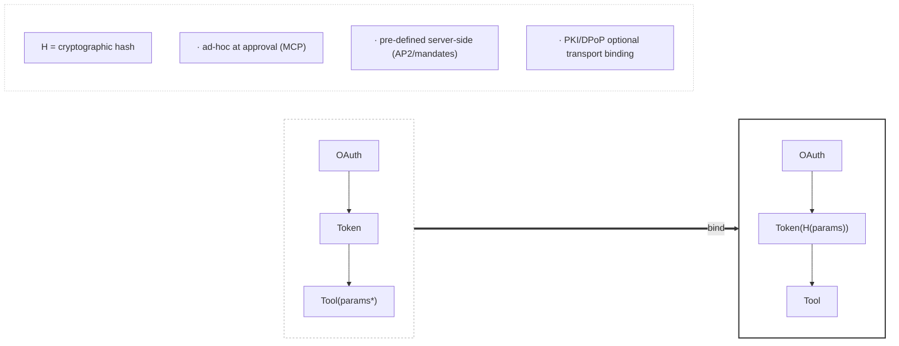
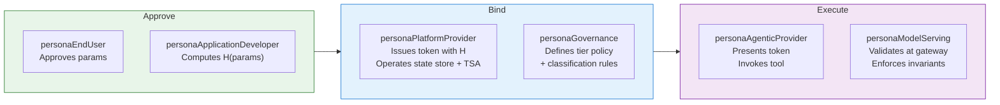

# Zero-Trust Tool Invocation Standard
## Universal Metadata Layer for Secured Remote Execution

**Version:** 1.3.0  
**Status:** Draft  
**Framework Alignment:** CoSAI-RM, MITRE ATLAS, OWASP Top 10 for LLM

---

## Abstract

Tool invocation in agentic AI systems is remote code execution. This standard defines a **protocol-agnostic metadata layer** that cryptographically binds authorization to execution parameters, eliminating the vulnerability window between user intent and tool execution.

The pattern works with—not against—existing protocols (MCP, AP2, OAuth 2.x) by providing a security envelope that any framework can implement.

---

## The Fundamental Problem



**The vulnerability:** Traditional authorization grants broad permissions. Parameters flow unvalidated from agent interpretation to tool execution.

**The solution:** Cryptographic hash binding at authorization time. Parameters become immutable "code" that cannot be modified post-approval.

---

## Axioms

### Axiom 1: Parameter Integrity
```
H(approved_params) == H(executed_params)
```
The hash of parameters approved by the user MUST equal the hash of parameters executed by the tool. Any deviation indicates tampering or misinterpretation.

### Axiom 2: Atomic Consumption
```
consume(token.jti) → {success: once, failure: always}
```
Each authorization token MUST be consumable exactly once via atomic operation. Replay is impossible by construction.

### Axiom 3: Temporal Binding
```
now() ∈ [token.nbf, token.exp]
```
Authorization is valid only within a defined temporal window. Default: 30 seconds.

### Axiom 4: Identity Binding
```
token.sub == authenticated_user.id
token.tool == requested_tool.name
```
The token MUST bind a specific identity to a specific tool. No delegation, no scope expansion.

### Axiom 5: Hash Provenance (Protocol Agnostic)
```
H(params) := {
  ad-hoc:      client-generated at user approval (MCP model)
  pre-defined: server-generated at mandate definition (AP2 model)
}
```
The hash MAY originate client-side or server-side. Both models satisfy parameter integrity when properly implemented.

---

## Persona Responsibilities

Each axiom and tier distributes accountability across [CoSAI-RM personas](https://github.com/cosai-oasis/cosai-rm). The invocation flow passes through multiple personas — from the end user who approves parameters, through the agent that invokes, to the platform that enforces.



| Persona | Responsibility | Invariants |
|---------|---------------|------------|
| **personaEndUser** | Approves parameters before hash binding (ad-hoc mode) | INV-3 (approval source) |
| **personaApplicationDeveloper** | Computes parameter hash; implements client-side signing | INV-3 (hash producer), INV-6 (client signature) |
| **personaPlatformProvider** | Issues bound tokens; operates IdP, state store, TSA; DPoP infrastructure | INV-1, INV-2, INV-4, INV-5 (producer) |
| **personaAgenticProvider** | Presents token and invokes tool; must not modify params post-hash | INV-1 (presents), INV-3 (preserves) |
| **personaModelServing** | Validates all invariants at gateway before tool execution | All INVs (verifier) |
| **personaGovernance** | Defines tier policy, classification-to-tier mapping, audit requirements | Tier selection, classification rules |
| **personaModelProvider** | Defines mandate schemas for pre-defined binding mode (AP2) | INV-3 (schema source for pre-defined mode) |
| **personaModelConsumer** | Reviews audit logs; inspects invocation provenance | Audit verification |

**Identification heuristic:** If your team *approves* parameters, you are the hash source. If your team *issues tokens*, you own binding invariants. If your team *executes tools*, you own validation. If your team *defines which tier applies*, you own governance.

---

## Components

Following CoSAI-RM taxonomy:

| Component | Description | Security Role | Responsible Persona |
|-----------|-------------|---------------|---------------------|
| **Identity Provider** | OAuth 2.x / OIDC issuer | Authenticates WHO | personaPlatformProvider |
| **Authorization Service** | Token generation with parameter binding | Binds WHAT to WHO | personaPlatformProvider |
| **Atomic State Store** | Redis, etcd, DynamoDB | Enforces single-use (Axiom 2) | personaPlatformProvider |
| **Validation Gateway** | Hash verification, temporal checks | Enforces Axioms 1, 3, 4 | personaModelServing |
| **Tool Endpoint** | Target execution environment | Executes only validated requests | personaAgenticProvider |

---

## Risks & Controls

### Risk: Parameter Tampering (ATLAS: AML.T0048)
**Threat:** Agent or MITM modifies parameters between approval and execution.  
**Control:** Axiom 1 — Hash binding detects any modification.

### Risk: Replay Attack (ATLAS: AML.T0040)
**Threat:** Captured token reused for unauthorized execution.  
**Control:** Axiom 2 — Atomic consumption; Axiom 3 — Temporal expiry.

### Risk: Agent Misinterpretation (OWASP-LLM: LLM04)
**Threat:** LLM regenerates different parameters than user intended.  
**Control:** Axiom 1 — User-approved params hashed before agent processing.

### Risk: Privilege Escalation (STRIDE: Elevation of Privilege)
**Threat:** Token used for unintended tool or scope.  
**Control:** Axiom 4 — Per-tool, per-identity binding.

### Risk: Session Hijacking (ATLAS: AML.T0024)
**Threat:** Long-lived token stolen and misused.  
**Control:** Axiom 3 — 30-second TTL; Optional DPoP transport binding.

### Risk: Persona Boundary Violation
**Threat:** A persona performs actions outside its designated scope (e.g., personaAgenticProvider modifying parameters after hash binding, or issuing its own tokens).  
**Control:** Trust policy restricts each persona to its designated invariants. Validation gateway rejects requests where the acting persona does not match expected role for the operation.

---

## Binding Modes

### Mode A: Ad-Hoc Binding (MCP Model)
Hash generated client-side at user approval time.

```
personaEndUser approves params → personaApplicationDeveloper computes H(params) →
personaPlatformProvider issues Token(H) → personaAgenticProvider presents Token →
personaModelServing validates H → Tool executes
```

**Use case:** Interactive approvals, human-in-the-loop workflows.

### Mode B: Pre-Defined Binding (AP2/Mandate Model)  
Hash generated server-side at mandate definition time.

```
personaGovernance defines mandate → personaModelProvider computes H(allowed_params) →
personaPlatformProvider issues Token(H) → personaAgenticProvider presents Token →
personaModelServing validates H → Tool executes
```

**Use case:** Automated workflows, pre-approved operation sets.

### Mode C: Hybrid
Server defines parameter schema; client binds specific values within schema.

```
personaModelProvider defines H(schema) → personaApplicationDeveloper binds H(schema + values) →
personaPlatformProvider issues Token(H_combined) → personaModelServing validates → Tool executes
```

**Use case:** Constrained flexibility with guardrails.

---

## Metadata Schema (v1.1)

### Required Fields

```yaml
transaction:
  id: string          # Unique transaction identifier
  timestamp: ISO-8601 # Request initiation time

identity:
  sub: string         # User identifier (from OAuth)
  provider: string    # Identity provider identifier

action:
  tool: string        # Tool/operation identifier
  parameters_hash: string  # H(params), hex-encoded
  binding_mode: enum  # "ad-hoc" | "pre-defined" | "hybrid"

authorization:
  token: string       # Ephemeral JWT
  expires_at: ISO-8601
  jti: string         # Unique token ID for atomic consumption
```

### Optional Fields

```yaml
transport:
  dpop_proof: string      # DPoP JWT for transport binding
  tls_fingerprint: string # Certificate fingerprint

classification:
  level: integer      # 1-5, per data sensitivity
  requires: array     # ["ephemeral_token", "dpop", "audit"]

provenance:
  hash_origin: enum   # "client" | "server"
  hash_algorithm: string  # "SHA256" | "SHA3-512"
  hash_producer_persona: enum  # "personaApplicationDeveloper" | "personaModelProvider"
```

---

## Validation Sequence

```
1.  VERIFY token signature
2.  ASSERT token.sub == authenticated_user.id             [Axiom 4]
3.  ASSERT token.tool == requested_tool                   [Axiom 4]
3a. VERIFY presenting_persona == authorized_role          [Persona scope check]
4.  ASSERT now() < token.exp                              [Axiom 3]
5.  ASSERT H(request.params) == token.parameters_hash     [Axiom 1] ← critical
6.  ASSERT atomic_consume(token.jti) == success           [Axiom 2]
7.  IF dpop_present: VERIFY dpop_proof binds to token     [DPoP]
8.  IF signature_present: VERIFY client signature         [Client pre-sign]
9.  EXECUTE tool(params)
10. LOG transaction for audit
```

Step 5 is the critical differentiator from traditional OAuth. Step 3a ensures the entity presenting the token holds the correct persona role. Steps 1-4, 6 are standard JWT validation with atomic consumption.

---

## Framework Mappings

| Standard | Reference | Coverage |
|----------|-----------|----------|
| **MITRE ATLAS** | AML.T0024, AML.T0040, AML.T0048 | Session hijacking, replay, tampering |
| **OWASP LLM Top 10** | LLM04, LLM06, LLM08 | Prompt injection, sensitive disclosure, excessive agency |
| **NIST AI RMF** | GOVERN 1.1, MAP 3.1, MEASURE 2.1 | Risk governance, threat identification, monitoring |
| **STRIDE** | Spoofing, Tampering, Repudiation, Elevation | Full coverage via axioms |
| **CoSAI-RM** | Personas, Controls | Persona-scoped accountability |

---

## Differentiation from RFC 9396 (RAR)

| Aspect | RFC 9396 RAR | This Standard |
|--------|--------------|---------------|
| **Parameter Binding** | Pre-registered types | Ad-hoc or pre-defined hash |
| **Server Requirements** | Maintain parameter registry | Validate hash match |
| **Flexibility** | Limited to registered schemas | Any parameter combination |
| **Complexity** | Schema definition overhead | Hash computation only |

**Key insight:** RAR transmits semantics for server validation. This standard transmits commitments for hash verification. The server need not understand parameters—only verify integrity.

---

## Implementation Tiers

### Tier 1: Minimum Viable (Class 4-5 tools)
- Ephemeral tokens (30s TTL)
- Parameter hash in token claims
- Atomic JTI consumption
- Hash validation on execution

### Tier 2: Enhanced (Class 2-3 tools)
- Tier 1 requirements
- DPoP transport binding
- Comprehensive audit logging
- Classification-based routing

### Tier 3: Maximum (Class 1 tools)
- Tier 2 requirements
- Client-side pre-signing
- Certificate pinning
- Hardware-backed key storage

---

## Vendor Integration Checklist

```yaml
minimum_viable:
  - [ ] Generate ephemeral tokens with ≤30s TTL
  - [ ] Include parameters_hash in token claims
  - [ ] Implement atomic JTI consumption
  - [ ] Validate H(request.params) == token.parameters_hash
  - [ ] Return structured error responses
  - [ ] Bind token-issuing personas to personaPlatformProvider role

enhanced:
  - [ ] Support DPoP proof validation
  - [ ] Implement binding_mode field
  - [ ] Add classification-based controls
  - [ ] Comprehensive audit trail
  - [ ] Add persona scope validation at gateway (step 3a)

maximum:
  - [ ] Require client signatures
  - [ ] Support pre-defined hash mode
  - [ ] Certificate/key pinning
  - [ ] HSM integration for signing keys
```

---

## Security Guarantees

When all axioms are satisfied:

1. **Integrity:** Executed parameters == approved parameters
2. **Authenticity:** Request originates from authenticated identity
3. **Non-replayability:** Each authorization usable exactly once
4. **Temporal containment:** Exposure window ≤ 30 seconds
5. **Protocol independence:** Works with MCP, AP2, OAuth, custom protocols
6. **Persona accountability:** Each step in the invocation chain is traceable to a scoped role

---

## References

- [CoSAI Risk Map](https://github.com/cosai-oasis/cosai-rm)
- [MITRE ATLAS](https://atlas.mitre.org/)
- [OWASP Top 10 for LLM](https://owasp.org/www-project-top-10-for-large-language-model-applications/)
- [RFC 9449 - OAuth 2.0 DPoP](https://datatracker.ietf.org/doc/html/rfc9449)
- [RFC 9396 - OAuth 2.0 RAR](https://datatracker.ietf.org/doc/html/rfc9396)

---

## Appendix A: Six Cryptographic Invariants

| # | Invariant | Assertion | Tier | Responsible Persona(s) |
|---|-----------|-----------|------|------------------------|
| 1 | **Identity-Tool Binding** | `token.sub == user.id AND token.tool == request.tool` | 1 | personaPlatformProvider (produces), personaAgenticProvider (presents) |
| 2 | **Temporal Validity** | `now() < token.exp AND now() >= token.nbf` | 1 | personaPlatformProvider (sets TTL) |
| 3 | **Parameter Integrity** | `sha256(actualParams) == token.parameters_hash` | 1 | personaEndUser (approves), personaApplicationDeveloper (hashes), personaModelServing (validates) |
| 4 | **Atomic Consumption** | `atomicStore.compareAndSet(jti, null, "consumed")` | 1 | personaPlatformProvider (state store) |
| 5 | **Transport Binding (DPoP)** | `verify(dpopProof) AND sha256(token) == ath` | 2 | personaPlatformProvider (DPoP infra) |
| 6 | **Client Signature (Enhanced)** | `verify(invocationSignature, clientPublicKey)` | 3 | personaApplicationDeveloper (signs) |

**Invariant 3 is the critical differentiator.** Traditional OAuth validates identity; this standard validates intent.

### Invariant Dependency Graph

```
Tier 1 (Required)          Tier 2 (Enhanced)       Tier 3 (Maximum)
─────────────────          ─────────────────       ────────────────
[1] Identity-Tool ─┐
[2] Temporal      ─┼──→ [5] Transport (DPoP) ──→ [6] Client Signature
[3] Parameter     ─┤
[4] Atomic        ─┘
```

Tier 1 invariants are mandatory for all implementations. Tier 2+ are additive based on data classification.

---

## Appendix B: Persona ↔ Invariant Quick Reference

| Persona ID | Produces / Operates | Verifies | Governs |
|------------|---------------------|----------|---------|
| `personaEndUser` | Parameter approval (ad-hoc mode) | — | — |
| `personaApplicationDeveloper` | H(params) computation, client signature (INV-3, INV-6) | — | — |
| `personaPlatformProvider` | Bound tokens, state store, TSA, DPoP (INV-1, INV-2, INV-4, INV-5) | — | — |
| `personaAgenticProvider` | Token presentation, tool invocation | INV-3 (must preserve params) | — |
| `personaModelServing` | — | All invariants at gateway | — |
| `personaGovernance` | — | — | Tier policy, classification rules, audit requirements |
| `personaModelProvider` | Mandate schemas (pre-defined mode) | — | — |
| `personaModelConsumer` | — | Audit log inspection | — |
